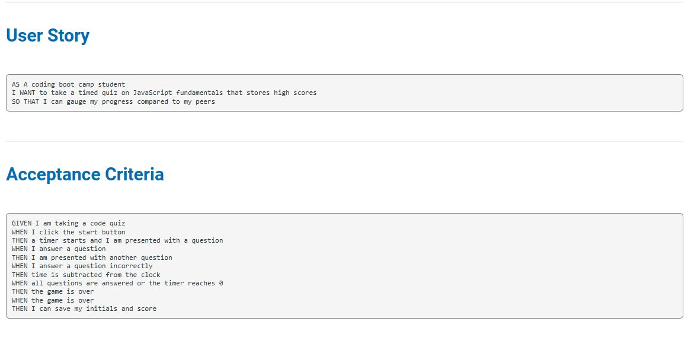
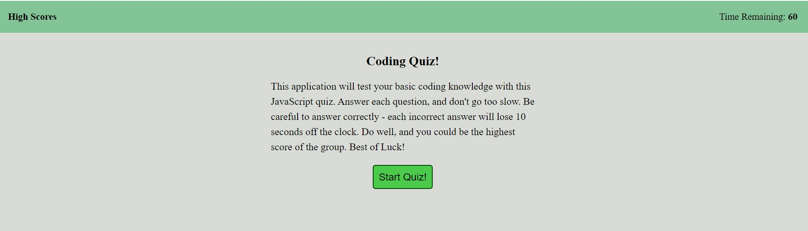
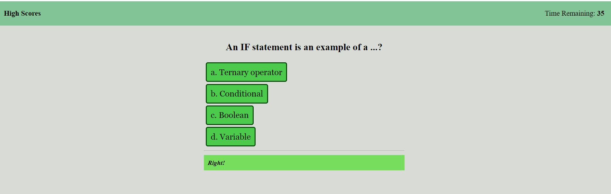
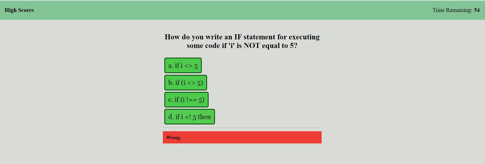
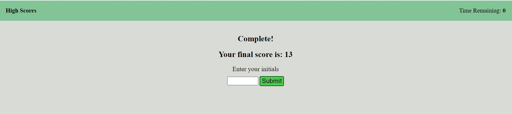
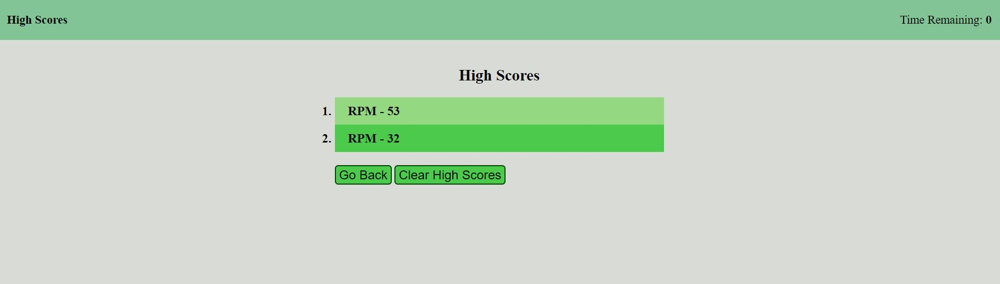

# Timed JavaScript Code Quiz Challenge

# Deployed Application:
https://ryanmcelwee.github.io/code-quiz/

# Description
This is a timed JavaScript code quiz with a high score list. Users begin by clicking the 'Start' button. The timer starts to count down and the user is presented with a series of questions to answer. When the user clicks an answer, a message will flas 'Right' or 'Wrong' to indicate if they responded with the correct or incorrect answer and the next question is displayed. A 10 second deduction to the time will occur if the answer is incorrect. When the user reaches the end of the quiz, or time runs out, any remaining time is the users score. The user may enter their initials into the text box, which will be displayed on the High Scores screen. High Scores are stored in local storage and displayed from highest to lowest.

# Technology used
- HTML
- CSS
- JavaScript

# Requirements

# Screenshots

